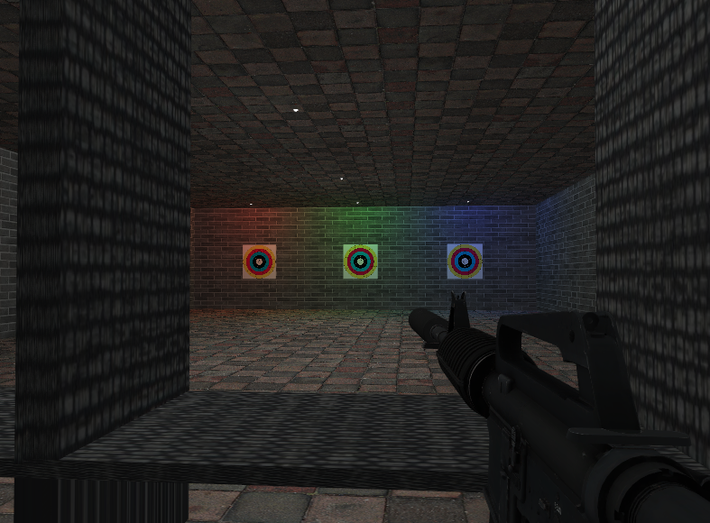

# OpenGL FPS Shooting Demo

C++와 OpenGL을 사용해 제작한 3D FPS 슈팅 데모 프로젝트입니다.
OpenGL SuperBible 7th Edition의 `sb7` application framework를 기반으로 FPS 카메라, 총기 조작, 사격 판정, 반동, 장전, 타겟 피격 표시, 사운드 재생을 구현했습니다.

## Demo Video

[](https://youtu.be/3UdZFD5EFbg)

https://youtu.be/3UdZFD5EFbg

## Features

- FPS 시점 카메라 이동 및 조작
- 라이플 / 권총 총기 전환
- 반자동 / 자동 사격 모드
- 탄약 및 장전 시스템
- 총기 반동 및 카메라 반동
- Ray 기반 타겟 피격 판정
- 피격 위치에 bullet mark 렌더링
- OBJ 모델 로딩
- 텍스처 매핑
- Phong lighting 기반 GLSL 셰이더
- 총기 발사 / 장전 / 전환 사운드 재생

## Tech Stack

- C++
- OpenGL
- GLSL
- SuperBible 7 `sb7` framework
- GLFW
- stb_image
- miniaudio

## Controls

| Input | Action |
| --- | --- |
| W / A / S / D | 이동 |
| Mouse Move | 시점 조작 |
| Left Click | 발사 |
| R | 장전 |
| 1 / 2 | 총기 전환 |
| B | 라이플 사격 모드 전환 |
| F | 손전등 |
| Space | 점프 |
| M | 와이어프레임 모드 전환 |

## Implementation Notes

### FPS Camera

마우스 입력을 yaw / pitch 값으로 변환하고, 이를 기반으로 카메라 방향 벡터를 계산했습니다.
이동은 카메라의 forward/right 벡터를 사용해 FPS 방식으로 처리했습니다.

### Shooting and Hit Detection

사격 시 카메라 위치와 방향을 기준으로 ray를 생성하고, 타겟 평면과의 교차 여부를 계산했습니다.
교차 지점이 타겟 영역 내부에 있으면 피격으로 처리하고, 해당 위치에 bullet mark를 렌더링합니다.

### First-Person Weapon Rendering

총기가 월드에 고정된 오브젝트처럼 보이지 않고 사용자가 들고 있는 것처럼 보이도록 카메라 행렬을 활용했습니다.
카메라의 방향 벡터와 위치를 기반으로 역행렬을 구성하고, 이를 총기 모델 변환에 적용해 화면 앞쪽에 고정된 1인칭 무기처럼 렌더링했습니다.

### Weapon System

각 총기는 `GunModel` 클래스로 관리합니다.
탄약 수, 장전 상태, 연사 여부, 발사 간격, 총기 반동, 카메라 반동을 총기별 상태로 분리했습니다.

### Rendering

GLSL 셰이더를 사용해 Phong lighting을 구현했고, diffuse/specular texture를 적용할 수 있도록 모델 클래스를 구성했습니다.

## Project Structure

```txt
CGP_VS2022/
  CGP_VS2022.sln
  include/
  lib/
  _myApp_/
    main.cpp
    include/
      Model.h
      GunModel.h
      stb_image.h
      miniaudio.h
    assets/
      models/
      textures/
      sounds/
      shaders/
```

## Build

Visual Studio 2022와 VS Code 환경에서 모두 빌드 및 실행할 수 있도록 구성하였습니다.

## What I Learned

- OpenGL 렌더링 파이프라인의 기본 구조
- GLSL 셰이더 작성 및 uniform 전달
- OBJ 모델과 텍스처 로딩
- FPS 카메라와 마우스 입력 처리
- Ray 기반 간단한 피격 판정
- 총기 상태 관리와 반동 처리
